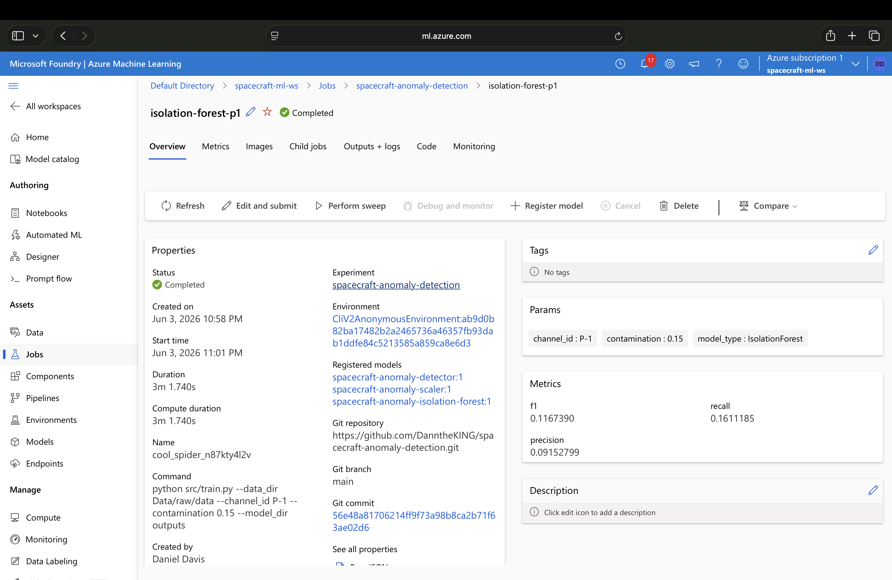
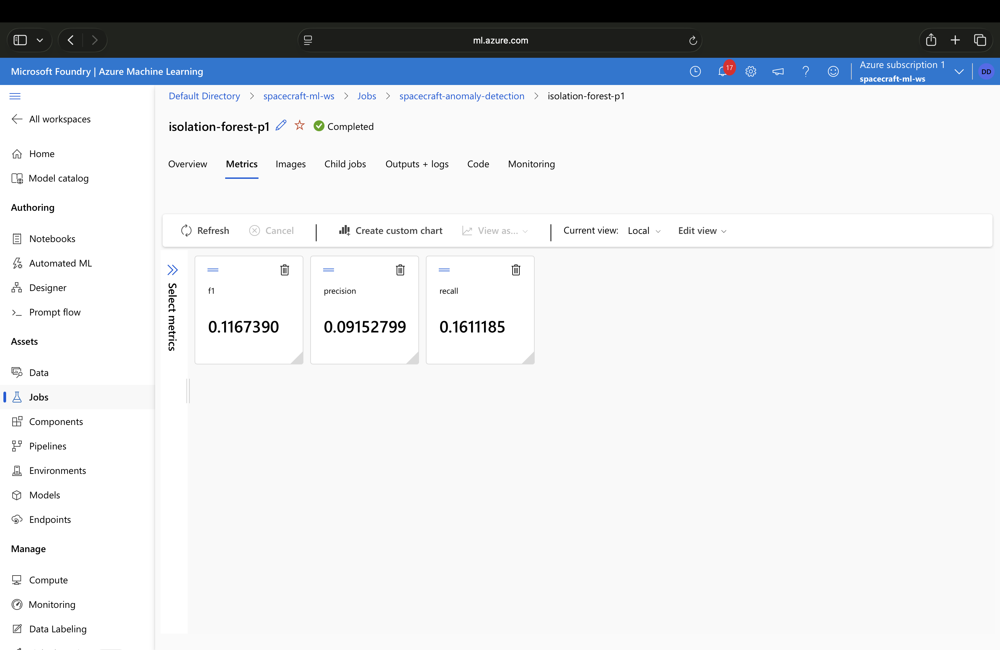
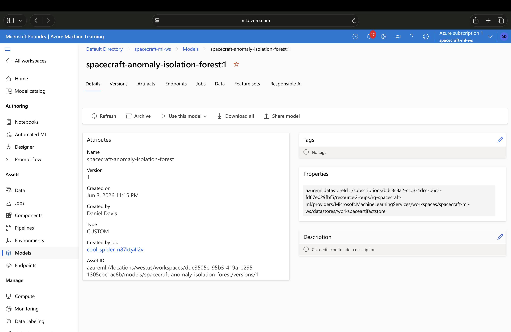

# Spacecraft Telemetry Anomaly Detection Platform

End-to-end machine learning and MLOps platform for detecting anomalous spacecraft telemetry using NASA SMAP/MSL mission data and Azure Machine Learning.

## Project Highlights

* Built an anomaly detection pipeline using NASA spacecraft telemetry data.
* Trained and evaluated Isolation Forest models on multivariate telemetry streams.
* Leveraged Azure Machine Learning managed compute for cloud-based model training.
* Tracked experiments and metrics using MLflow.
* Registered trained models in Azure Machine Learning Model Registry.
* Implemented a production-oriented MLOps workflow from training through model management.

## Architecture


```text
NASA Telemetry Dataset
          ↓
Data Preprocessing
          ↓
Feature Scaling
          ↓
Isolation Forest Training
          ↓
Azure ML Training Job
          ↓
MLflow Experiment Tracking
          ↓
Azure Model Registry
```

---

## Azure Machine Learning Workflow

### Azure Training Job



### Experiment Metrics



### Model Registry



---

## Business Problem

Modern spacecraft generate thousands of telemetry measurements that engineers must continuously monitor to identify abnormal behavior.

This project investigates whether unsupervised machine learning can identify abnormal spacecraft behavior before mission-impacting failures occur.

---

## Dataset

**Source:** NASA SMAP/MSL Telemetry Dataset

The dataset contains telemetry channels collected from:

* Soil Moisture Active Passive (SMAP) Satellite
* Mars Science Laboratory (MSL) Rover

Example channel:

```text
P-1
Train Shape: (2872, 25)
Test Shape: (8505, 25)
```

---

## Machine Learning Approach

### Feature Engineering

* StandardScaler normalization
* Multivariate telemetry processing
* Ground-truth anomaly range generation

### Model

Isolation Forest was selected because it:

* Requires no anomaly labels during training
* Scales efficiently to large telemetry datasets
* Performs well on high-dimensional sensor data

---

## Experiment Results

| Metric    | Score |
| --------- | ----- |
| Precision | 0.092 |
| Recall    | 0.161 |
| F1 Score  | 0.117 |

### Hyperparameter Experiments

| Contamination |
| ------------- |
| 0.01          |
| 0.02          |
| 0.05          |
| 0.10          |
| 0.15          |

Experiments were tracked using MLflow and Azure Machine Learning.

---

## Azure MLOps Components

### Infrastructure

* Azure Resource Group
* Azure Machine Learning Workspace
* Azure Compute Cluster
* Azure ML Model Registry

### Experiment Tracking

Tracked metadata includes:

* Hyperparameters
* Precision
* Recall
* F1 Score
* Training configuration

### Model Management

* Registered trained models in Azure ML Model Registry
* Managed model artifacts and versions
* Established foundation for deployment workflows

---

## Technologies

### Machine Learning

* Python
* NumPy
* Pandas
* Scikit-Learn
* Isolation Forest
* MLflow

### Cloud & MLOps

* Azure Machine Learning
* Azure ML Compute Clusters
* Azure ML Model Registry
* MLflow Tracking

### Development

* Git
* GitHub
* Jupyter Notebook

---

## Future Enhancements

* Autoencoder-based anomaly detection
* LSTM sequence modeling
* Hyperparameter optimization
* CI/CD pipelines
* Automated retraining workflows
* Real-time telemetry streaming

---

## Resume-Relevant Skills Demonstrated

* Machine Learning Engineering
* MLOps
* Azure Machine Learning
* Experiment Tracking
* Model Registry
* Cloud-Based Training
* Data Engineering
* Aerospace Analytics
